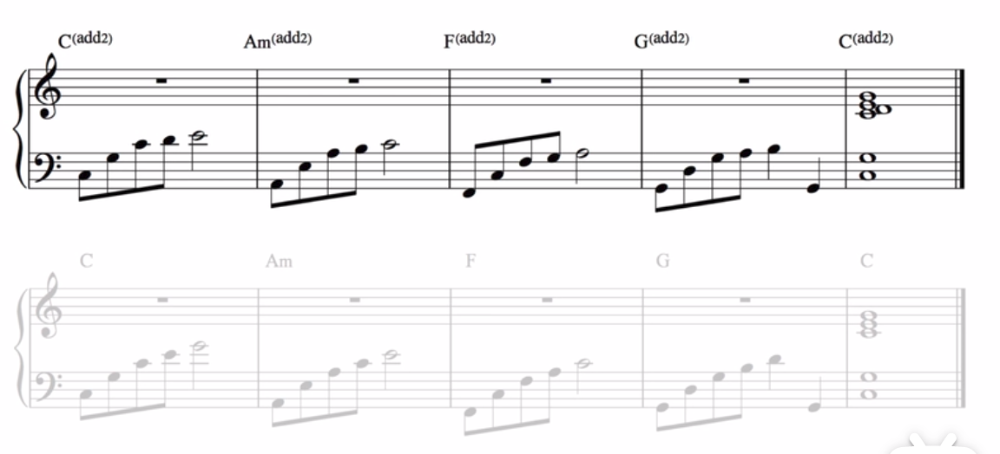
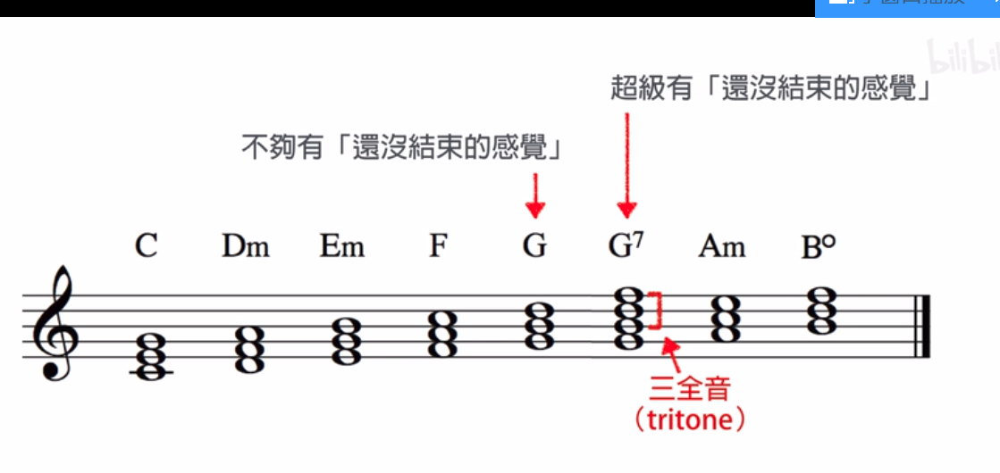
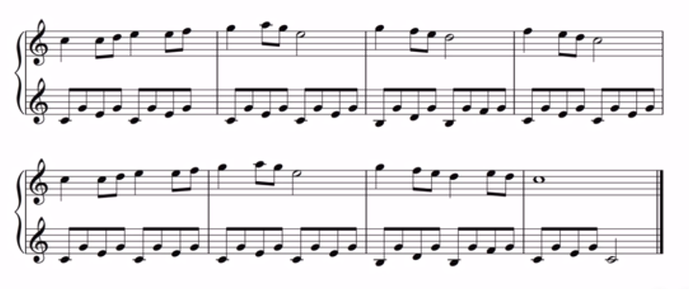
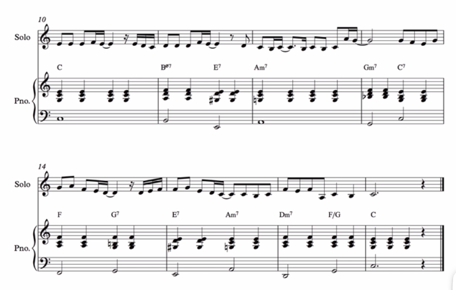
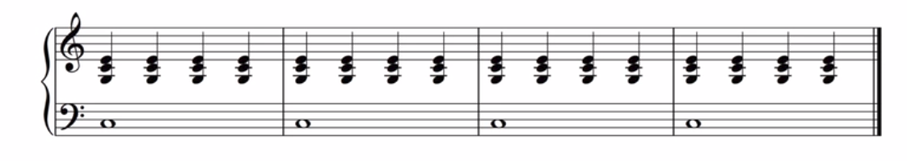
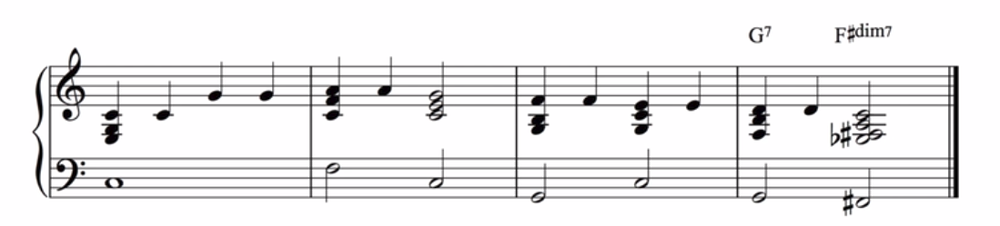
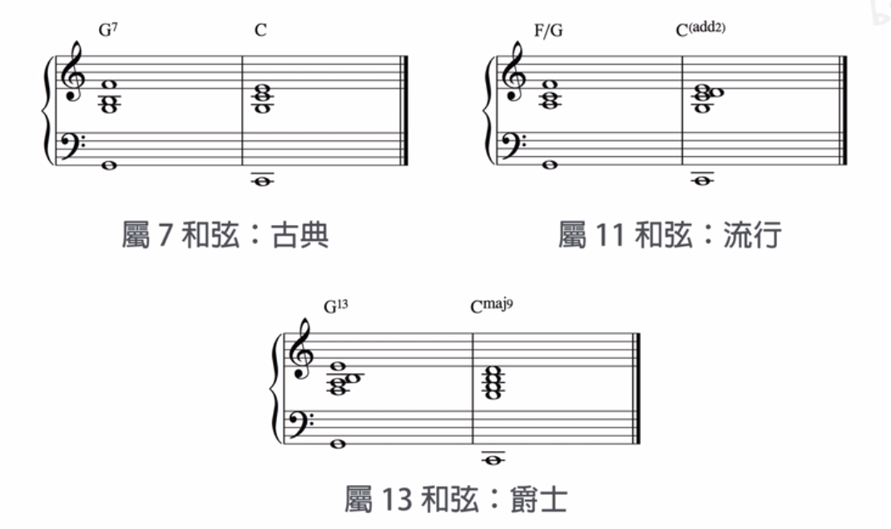
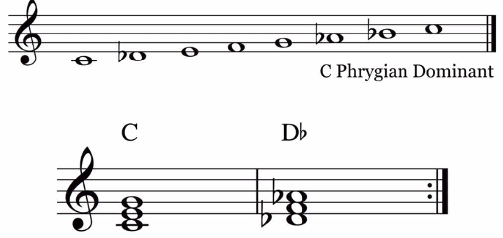
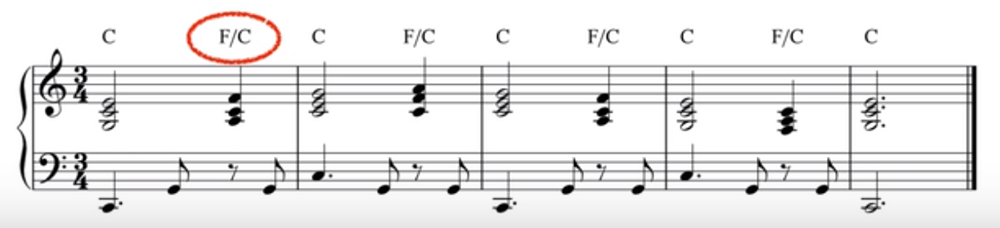

**NiceChord Notes**
By ZYF

**目录：**
[toc]
  
### Ep2. 和弦代号
- **三和弦**：三个音的和弦
- **七和弦**（及以上）：不再根据音的数量，而是**跨度**。这里是四个音的和弦，跨七度
- 最多到**十三和弦**。因为如果有十五和弦，第一个音和最后一个音重复了
- 最常见的三类和弦：**大、小、属**

- 更复杂的：

 
- 和弦记法：例如Cm7，C代表根音，m7代表哪一种和弦
- 一些具体例子（以根音是C为例）：

- 注：
    - 属和弦最小也得有**4个音**
    - sus**默认是sus4**
    - 半减、减、小大、增大、增属可暂时不深究
    - 两个降号是**重降**，即降两个半音

- 小测试：下面两个分别是什么和弦？

- 答案：$E^{\flat maj13(\sharp 11)}$和$B^{\flat 9sus}$
 
 
### Ep3. 加二度音
- 下图右边是加二度音

- 注意这里$C_2$是**下标**，而属和弦是**上标**
- 加二感觉会**更有流行的风格**，因为加二会给人**模糊**的感觉（三个音123距离很近）。而且一般来说加二和不加二功能差不多。下面是一个简单的16451和声进行。高亮的段落左手最高音降为3，因为有+2存在。可以试试音响效果的差异

- 下面是一个1564的和声进行，使用了**加二**的技巧。可以顺便学学节奏的处理。（暂不深究如此复杂的伴奏）

### Ep4. Ghost note（鬼音）
- 五线谱第一条线是大鼓，第三条线是小鼓
- 可供低音节奏的参考。举例如下，从上至下越来越复杂。例如第三个是在小鼓上加了两个ghost note

 

### Ep5.基本和弦功能
- 以下列出了从二级和弦到七级和弦的定义。一般习惯把G和弦加一个7，因为F和B不和谐，跨度正好是5，三个全音符的跨度（所谓半音就是琴键上类似1到#1的跨度，全音是类似1到2的跨度，这里的三全音的计算方法是：B到#C是一个全音，#C到#D是一个全音，#D到F是一个全音），所以叫**三全音**，这样就更有**没结束的感觉**

- 本集介绍了三种最基础的和弦：主、下属、属

- 它们的先后关系如下图所示。注意一般**没有从属和弦到下属和弦**的操作，因为属和弦太紧张，回到下属不够满足。

- 以下是常见的“**451**”进行（“451”“251”都很常见）的例子：

### Ep6.基本和弦功能
（基于[Ep5](#Ep5)的知识点）

- 下面这个表格从左到右是按顺序进行的和弦。每一列**任选一种**可以接到下一列的**任选一种。**
- Em和Am姑且称作“暂时的家”，但真正的家也可以接到“暂时的家”，“暂时的家”之间也可以通行。
- 可以从家到桥，或直接到外面。但一般会经过桥，这样从G7接回C更有满足感。
- 可以从一座桥到另一座桥，或从桥到外面。
- 但外面很少用Bdim，一般用G7. 到了外面一般就只能回家了，如果回桥不够有满足感。注意第四列的Em和Am还有箭头，意思是它们一般不会是乐曲的结尾，还要接到别的和弦。
- 所以根据排列组合一共有5*5*2*3=150种理论可行的和声进行。

|家	|桥	|外面	|家 |
| - | - | - | - |
|C	|F	|G or G7	|C|
|C->Em	|Dm	|Bdim	|Em->|
|C->Am	|F->Dm	|/	|Am->|
|C->Em->Am	|Dm->F|	/	|/|
|C->Am->Em	|直接跳过桥	|/	|/|

- 举例1364251：

 
### Ep7.12小节蓝调
- 原版：

- 改进：省略5度音，把最低音降八度

- 存在问题：高音差别太大

- 改进：这不是转位，因为最低音没改。

- 改进：加点花，9度和13度，注意衔接平稳，所以音之间不要差太多

- 左手是bass，右手是刚刚决定好的和弦

 

 
### Ep8.音程
- 基本名词“度”：从一个音的名字念到另一个音的名字，总共念过几个字，它们的距离就是**几度**。**和黑白键没关系**。举例如下：

- 在**大调音阶**里，每一个音与第一个音的距离，都叫做“完全”或“大”音程。
- **巧记：1458（=你是我爸）是“完全”，2367是“大”**。这里的数字表示多少“度”，例如大二度，完全四度……但不存在完全二度，大四度……
- 以E major为例：

- 对于1458，（从小到大）有“减”“完全”“增”的说法，对于2367，（从小到大）有“减”“小”“大”“增”的说法。
- 请看下面两个例子对于音程的分析：

### Ep.9阿贝尔蒂低音：“低高中高”模式
- 下图的左手就是“阿贝尔蒂低音”的模式，比较适合儿歌民谣，比较可爱

 
- 注意音的高低，别太低，在**中央八度或低一个八度**较合适

 
- 像上面三个音的和弦，可以分出低中高。遇到四个音的和弦，怎么拆解？
    - 一种方法是**省略5度**：
    
 
    - 另一种方法如下。注意，**右手有5时还是弹5474，否则没有5就不是G7了**
    

 
### Ep10. 走路低音
- 以例子来讲解。这部分内容在bass上演奏比较有效果
- 原始的分解和弦

- 重新换顺序+八度调整，顺畅一些。每小节第一个音不用调整。

 
- 经过音（即使用非和弦的音）

- 另一种方法，使用下一个音的高半音，比较有意思

- 换节奏：

 
### Ep11. 简易流行歌伴奏
- 所谓的“1+3”配置

- 低音**一般是根音**

- 配置时，注意**选择离上一个和弦较近的音**。比如C用了第二转位，Em用了第一转位等等。如果不用转位的话，右手最低音跳来跳去，不平稳。
- 关于转位，这里稍作补充：每个三和弦有两个转位：以三音为低音是第一转位，称作六和弦（记作6）；五音为低音是第二转位，称作四六和弦(记作${\displaystyle _{4}^{6}}$)。

- 简易伴奏：套路是**重复和弦，四分音符**，左手只在换根音时弹即可

- 一个例子：运用上面的知识。适合节奏慢的抒情曲。配和弦的细节暂不深究。

 

 
### Ep12. 更有节奏感的流行歌伴奏
- 以例子的修改来说明问题。
- 最开始：

- 后半拍加一个右手最低音：注意那个ghost note要弹小声，否则很吵

- 改成附点，避免过于均衡：

- 混合使用：

- 或者也可以在每小节的第四拍加入更多的音（ghost notes），创造一种**往下一个小节推进**的感觉。
- 例子：

- 改进：

 
### Ep14. 终止式
- 以《小星星》《小蜜蜂》为例
- **正格终止**的例子：由G7到C

- **半终止**的例子：到G7
 

 
### Ep15. 终止式（续，基于Ep14）
- **假终止**：**G7到不是C的地方**（通常是六度）
- A minor 有点忧郁

- 梦幻版/神圣版的终止：降A

- 慵懒的终止：降D major和弦：
 

- 晴天霹雳版：减七

 
- **变格终止**：F接C的终止。又叫教会终止或阿门终止。因为很多教会的歌都是F接C

 

 
### Ep16. 大和弦的四种口味
- 以C为例。大七和弦比三和弦更现代一些

- 调换顺序可得到不同的口味：

- 大九和弦，比大七更现代一些，同样换不同位置有不同口味：

- 例子：全都是大九和弦，比较朦胧、文青一些，或者说有都市感、现代感

- 改成如下的大三（还是大七？）和弦，更纯粹，坚定，有一种云消雾散，雨后初霁，阳光透射下来的感觉

- 碎碎念：发现官大为似乎喜欢在每个小节第一拍放附点+连音线（35或332），然后在最后一拍也搞个附点，不过左右手的附点位置错开，就可以在最后一拍，听到左右手配合的连续四个音这样的节奏。
 
- 加大六度，有一种老派的感觉，好像有点《夜上海》的味道？

- 再加上九度，有一种拉丁风的感觉，似乎更像爵士：

- 总结四种口味：

 
### Ep17.动感的低音线条
- 例如遇到需要在D minor7和G7之间来回切换的段落，在bass那里可以只配根音拉长4拍（不过太无聊了）
- 另一种方法：332或者切分

- 高八度低八度变化，比较安全：

- 加五度音：

- 加七度音：

- 混合（其他和弦音、经过音、随便的音，有亿点复杂）：

 
### Ep18. 很潮的属11和弦
- 比如要从F到C，古典的做法是G7到C，流行的做法可以把G7改成F/G（F和弦底下外加一个G），把C改成C add2

- F/G的真实构造，以及可以把省略的5度音加回来，（或者可以用G9sus）。不过一般不用完整的G11因为7和1会有点打架

 
- 第三种比较有趣，C major9有一种没有完全被解决的感觉

### Ep19. 很爵士的属13和弦
- 第一种配置，1-3-7-13，如上。为了配上属13的复杂度，终止式用C major 9

- 第二种配置，1-3-7-9-13，如上。一般采用分布比较平均的，二度的容易打架，不好听

- 第三种配置，1-7-9-11-13. G13（omit 3, omit 5）因为没有三度音的B，但有四度音的C，所以也写成G13sus

- 上面三种，1-7-13这三个必有
- 最后总结对比一下：

 
### Ep21-22. 大小调音阶基础

- 大调：全全半全全全半
- 小调：全半全全半全全（在第三第六第七个音上降半音）
- 关于小调音阶：作曲家希望小调最后两个音也能是G7接到C，因为G7含有与C相邻的B，很有要解决到C的趋势，但这里bB与C差了一个全音，解决的欲望不够强，文艺复兴时期的作曲家为了解决这个问题，把bB还原了。如下图：

- 以上叫和声小音阶，不过有一个很严重的问题，bA和B之间是增二度的关系，欧洲古典作曲家很反感这种在bA和B之间来回跑动的旋律，很邪门，像印度耍蛇的音乐。于是他们提出新规则：小调旋律中，如果有第六音，要接到已经升高的第七音，那么第六个音也要一起跟着升半个音。但从第七音接到第六音就保持原状即可。

 
### Ep23. 中古调式概述及巧记方法

### Ep24. Ionian、Dorian、Aeolian调式
- 实际上Ionian就是大调，Aeolian就是小调

- 真正代表小调的和弦应该是C minor bA，除了有凄惨的感觉还有悬疑恐怖的感觉，例如：

 
- 下面是Dorian，唯一和小调不同的地方在于大六度，这让它不凄惨恐怖，倒有一种神话的感觉：记得强调大六度以区分小调

 
- 假如打圈处还是小调的bB，会很有悲伤的感觉
 
### Ep25. Phrygian和Lydian调式
- 原本Phrygian只在bD上与小调不同，但这种调式很少用，用得更多的是它的属调，即把bE改成E，这种在西班牙音乐上很常见

- 一个经典的Phrygian伴奏方法就是右手随便在Phrygian的音上乱弹，左手在Phrygian构成大三和弦的这两个和弦之间来回切换

- Lydian：可以理解为#F的C大调，比较特别的是，如果三度三度地叠起来，可以构造出一个比较梦幻/科技感/爵士风格的结束音，windows98的开机音效就是这个

- 用Lydian的排列方式，在一级和二级和弦之间切换进行，有一种英雄主义/浩瀚宇宙的感觉

- 还有一种玩法，故意把#F和G组合起来弹，有一种弹错音的滑稽感，常用于卡通作品

- 辛普森家庭的主题曲：

 
### Ep26. Mixolydian和Locrian调式

- Mixolydian和C的区别就在于bB，由于有135b7属七和弦的存在，这使得它在爵士乐中比较常见：

- C7可以接到F，似乎只是F的附属品（一些古典音乐人的想法，不完全正确）

- 当然它也可以独立存在很久，不需要接到什么和弦。

- Locrian调式，因为有减五，是七个大调中最黑暗的，很少用，一般可能会在一些电玩中有

 
### Ep27. 全音音阶

- 例如C的全音音阶，即每个音之间都差一个全音，可以用如上的指法，弹出来就有一种永无止境的感觉，和半音阶类似。适用于儿童剧中坠入梦境的配乐。如果要梦醒，反过来弹就行

- 随机挑全音音阶中的音组成和弦，会发现弹出来很诡异、轻飘

 

 
### Ep28. 副属和弦/次属和弦
- 注意和下属和弦（参见Ep5）区分

- 原本是C→Em，但想在这之间插入点东西，如果是C大调，这相当于一级和弦接到三级和弦，而因为五级和弦很喜欢接到一级和弦（例如5->1），一种想法是，把Em当成假装的C，倒推Em的五级和弦B，或者使用紧张感更强的B7(omit 5). 

- 再举几个例子：C->G，可以在G前面加D7，C->Dm，中间插入A7
原版：164251

- 修改后：（如果只有两个音，像Dm和G7就不用再改了，本身就满足从Dm到C的条件）

- 发现只有E7 omit 5 了，omit 5 可能是根据需要来用的，不限于哪个和弦
 
### Ep29. 三全音代理
- G7喜欢接到C，但我们先去找和G7有相同三全音的属七和弦，这里是bD7.类似地E7

 
- 在最后一拍用新的和弦（一般是在）替换原来的和弦，大概率会有比较酷炫的感觉（当然有些可能有点怪？）
- 一般规律：去找比目标和弦高半音的和弦，如目标和弦是Fmaj7，比F高半音的属七和弦是#F7.

- 再如：

- 例子：不一定是属七和弦，只要是属和弦家族即可

 
### Ep30. 副属和弦——进阶（基于Ep28, Ep6）
- 二级和弦/四级和弦（“桥”的功能）很喜欢接到五级和弦，然后再由五级和弦接到一级和弦。即“251”模式。在流行/爵士中，更喜欢用二级和弦。按照副属和弦的逻辑，把下一个和弦当成C，前面接G，再前面接D minor，注意是minor！参考Ep5二级和弦的定义.
- 举例：C-> F maj7，中间可以插入C->Gm7->C7 (omit5)->F maj7. 

- 举例：C add2->G add2，可以如下处理，注意到G的五级和弦D7又omit 5，根据这几个例子的规律，应该是五级属和弦一般都处理成omit 5，但二级和弦用完整的属和弦？看后面的影片好像是为了消除和弦的厚重感/浑浊感所以omit 5

- 注意：目标和弦是小和弦时，前面插入的装饰性二级和弦，要变成一个半减七和弦，因为小调中自然发生的二级和弦就是半减七和弦。半减七和弦的定义见Ep2，即357音都降半音.
- 例如下面C->Am

 
### Ep31. 3种简单实用的钢琴伴奏（基于Ep11）
- 原版：

- 第一种：“蹦恰”模式：左手根音，右手剩下的

- 第二种：“332”模式

- 第三种：前三个音是分解琶音，第四个音卡在第二个半拍拉长，且第四个音是完整的和弦。这种模式由于是卡在第二个半拍拉长，和原来的拍子有抵触的感觉，从而有比较独特的节奏
例如《夜空中最亮的星》就是这种伴奏模式

 
### Ep35. sus2 和 sus4 和弦装饰（基于Ep2）
- 假设有一种情况：一长段都是一个和弦，而且又没法改成别的和弦，但又不想这么平淡，可以随机丢一些二度音四度音

- 进阶：

- 接着Ep28讨论过的164251模式，也可以这样改：

 
### Ep36. 用其它和弦装饰（基于Ep35）
- 原版：

- 用Dm/C装饰

- 用F/C装饰

- 检查一下其它的和弦：

- Em由于本身就在Cmaj7上，可以用；G同理，相当于Cmaj9(omit3)；Am可以看成Cadd6(omit5)，用得比较少；而Bdim这种不好听。
- 接下来是混合使用：

- 再举一例，这有点disco的感觉？
- 原版：

- 加料版：

 
### Ep37. 拿坡里和弦（基于Ep5）
- 定义：降II级的大三和弦。举例如下：

 
- 拿坡里和弦一般用其第一转位（中间那个）

- 一般遇到四级和弦或二级和弦可以考虑换成拿坡里和弦，会有一种Phrygian的味道？怪怪的
- 换成拿坡里和弦：

- 用第一转位：

- 贝多芬的月光一，这个地方用了拿坡里和弦

 
### Ep199. 五声音阶（原Ep38被删除）（基于Ep8）
- 大调五声音阶即12356的排列模式：1全2全3小三度5全6小三度1
不同的文明先后发现过它。这遵循一定的规律。例如八度之间的音频率比是1:2，如果从1开始不断按2:3的频率整数比往上找音，会先后找到15263这五声。
- 小调五声音阶即61235，如果从1开始就是1 b3 4 5 b7

- 如果想搞出有五声音阶的华彩，最简单的就是用宫调音阶爬上爬下，或者从黑键的#4开始刮奏只刮黑键

 
### Ep39. 五声音阶即兴
- 先测试12356和各级和弦是否搭配
- Em和C会形成小三度+六度的和弦，很悲伤，慎用，Gadd4也很怪，不用。其他都行
- 不考虑七级和弦，减和弦很少用。
- 结论：避免在Em和G7和弦上弹太多的C单音

 
### Ep41. 大和弦的11度音（基于Ep5 Ep8 Ep16）
- 一般不会直接用major 11和弦，因为135724有74这个三全音组合，大和弦不需要属和弦的紧张感。解决办法是把4改成#4（其实就是Lydian调式，见Ep25），这样叠到13度音都问题不大。13度音也可以省去11度。也就是有下面右侧三种配置。不过注意，大于9度音声响会比较刺激，甚至一般的流行乐都很少用。爵士用得多。

### Ep42. 酷炫的属和弦变化音
- 一般在变5级或者9级变半音。有四种方法：#5（又称b13音） b5（又称#11音） #9 b9
- 加上原来的5级或9级音，一共3*3=9种和弦：

- 需要经过很多实验才能知道何时用什么组合。例如下面的和弦进行，把C7改为C7(b9)，会有点忧郁：

 
- 这个有点纠结的感觉：

- 这个有点骄傲有点叼的感觉：

 
- 有些属11属13也可以变，以下是例子：（原版有节奏的变化，这里只是为了方便看）。原版比较阳光。
- 另外，这里连续地存在副属和弦？2514

 
- 修改后的：比较纠结，但有点酷炫

 
### Ep43. 小11和弦（基于Ep2）
- 就是降minor和弦那两个音。
- 关键是看左右手如何分配这些音。要有合理的间隔才好听。

- 或最高音降八度？

- 可以半音半音练习。最后一行是一个随便写的一个和弦进行，全都是小11和弦

 
 
### Ep44. 小11和弦（基于Ep43）
- 第三种配置方法：如下图中的Cm11，除了2和b3很接近以外，其他都离得比较远，久石让似乎很喜欢用？这种有点梦幻的感觉，经常出现在日本的一些RPG游戏中

- 一直用小11和弦即兴一段：

- 每个半音的练习：

 
### Ep45. 借用和弦/调式互换/调式混合
- 最直白的解释：同一主音，不同调式的和弦
- 以C major为例，正常的有上方的七种和弦，“不正常”的包含下方的小调产生的七种三和弦，可以用小调的和弦替换一部分原来的和弦

- 第一行是正常的，第二行是备选的（原版伴奏听视频）。好像《旅の途中》开头的伴奏有这种操作。可以大小调交替来，也可以只变Am，不建议滥用，听起来怪怪的？

 
### Ep46. 泛音列（略） 
### Ep47. 旋律创作 动机发展（略）
### Ep48. 像007的和弦（略）
### Ep49. Altered Scale（略）
 
### Ep50. 邻音、经过音、倚音
- 这三种音都是不属于和弦的音（这种定义可能不严谨，那D属于C9中的一个音啊？还是理解为只要左手不弹的都不属于和弦的音？）
邻音：从和声音出发，跑到邻近的音，再跑回来，中间那个就叫邻音。这是一种无脑增加伴奏音的方法

 
- 经过音：例如下面的《小蜜蜂》，夹在两个和声音之间的，但是从和声音出发到另一个和声音而不是折回到原来的和声音的，中间那个音就叫经过音

- 倚音：任何发生在相对强拍的和声外音，都叫倚音。前面两种都没有产生不协和感，但倚音是故意要制造一种不协和感，然后马上解决掉。例如《祝你生日快乐》的6就和左手135冲突了，但接下来的5就解决了冲突。其实这种制造冲突和解决冲突的方法，与G7->C的原理很像

 
### Ep51. 高低半音接到目标和弦（基于Ep28-30）
- 从Ep28算起，这是第四种让和弦音色变化的方法。以下三种分别是原版、高半音、低半音版本。注意不是所有音都高/低半音，是指和弦代号变了。当然这样滥用显得很刻意，应该在合适的地方偶尔用一两次就够了，反倒能给听众带来一点惊喜。

 
### Ep52. 用“251”来转调（基于Ep30）
- 用一个“251”和弦进行，接到低一个全音的“251”和弦进行

- 以下是一个连续转调的练习。可以套很多旋律，这里是全家便利店的旋律。
有网友推荐去看华晨宇的《蜡烛》，没听过hhh，里面可能有这种转调方式吧

 
 
### Ep53. fà国帅哥钢琴家最喜欢的伴奏模式（基于Ep9）
- 除了阿贝尔蒂低音，还有一种更常用的，即15353535，“低中高中高中高中”模式。在秋日私语、水边的阿狄丽娜、梦中的婚礼、童年的回忆等曲子里被大量使用。
- 适用的音域挺宽的，只要不要太低音都问题不大。
- 伴奏初学者喜欢用一种不那么好听的和弦15151515（低中高中高中高中），而三度音对于和弦是很重要的。因此避免使用。

 
- 再以《平安夜》为例：可以不用每个小节都是六个音，可以只有三个、四个、五个音

 
### Ep54. 琶音伴奏音程问题
- “稍微厚重”：不太推荐，尽管也OK
- 如果已经到了比中央C低两个八度的C，至少得用“呆呆的”那种方法，那种方法之所以呆是因为在五个音中出现了三个C，使得声响太偏向于C了，而且一般开头两个音最好不要是八度，太单调。
- 所以还可以再拉开一点，则有“兼具低音和干净”的方法
- 其实也不一定只拉开第一个音和第二个音的距离。后两种是拉开更多音距离的方法。

 
### Ep55. 数字低音、转位记号
- 定义：写出最低音，然后用数字标识低音上面几度的位置有其他的音。
- 关注转位的记号即可。
- 转位的意思是，最低音不是根音，这时候在斜线后面写上最低音的记号
- 第n转位就是一共把原和弦最下面的n个音提高八度后的和弦

 
 
 
### Ep56. 配和弦初步（仅考虑C与G7）（基于Ep14）
- 首先应当指出，配和弦没有正确答案，只有品位好坏。需要很多年的练习才能应用自如。这里先不考虑转位以及超过7度的和弦。在配和弦的过程中，应该思考这几个问题：
- Q1：现在是什么音？ ——然后配上含有那个音的和弦。但对于5，两种和弦都可以，选谁？

- Q2：下一个小节是什么音？
- A2：像下面的《小蜜蜂》，第三小节和第五小节可以很容易判断是C和弦，第四小节可以C也可以G7，但如果配C，连着三个C看起来没有什么进展，太静态了。因此用G7.
- Q3：我要让这个小节是告一段落的感觉，还是未完成的感觉？
- Q4：多久换一个和弦？
- A3A4：例如12小节，原来判断是只有C，但每一行（一行可以理解为一个乐句）最后都是C，也太单调了，而且没有规定一个小节只能换一次和弦。所以可以在一些小节的最后来个G7，这样到下个小节更有一种解决的满足感。而且第4小节和第12小节用了“半终止”的概念。

 
### Ep57. 再用其他和弦配和弦（基于Ep56）

- 如果只用C与G7去配《Jingle Bell》的前8小节，大概是这样子：

- 如果用Ep56 Q1的规则，那对于第6,7个小节，配G7或者C，都会有一些音照顾不到（第三个小节，只有一个音D照顾不到，1/4照顾不到，可以忽略。实际上《小蜜蜂》第三个小节中也会有照顾不到的问题），那我们就得决定取舍，哪些音当成和弦外音，或者用更复杂的和弦来同时满足（以后详细分析），另外也可以不用C或G7而考虑别的和弦。例如我们试试用F和弦来替换第5小节，毕竟有4个F。当然也可以考虑Dm，但Dm接到第6小节的C太黯淡，不建议这种操作。但第7小节是可以用Dm，这样一来避免连续两个G7的重复，二来7-9小节形成“251”的模式，好听。
- 以下是成品：

 
### Ep58. 使用C, Dm, Em, F, G7, Am来给C调的曲子配和弦（基于Ep6 Ep57）

- 以《平安夜》为例，本菜自己乱做的答案：
C C Em Am G7 G7 C C
F F C C F F C Am
Dm G7 C C C G7 C C （连着三个C肯定不行但看影片之前我确实不知道咋搞hhh）
- 复习一下和弦连接表（Ep6）后，我们先用C，F，G7来配。也就是一“家”一“桥”一“外面”，为什么桥不先考虑Dm可能是觉得Dm是小调和弦，用不好会比较黯淡。如下：

- 注意上面的例子，单看第8小节也有配G7的可能，但下一节是F，而没有G7->F这种操作。
- 开头能不能是G7？一般不会这样干，毕竟这是C调，以C开始比较正常。
- 检查G7，发现有两处用了连续两个G7，可以考虑把第一个G7换成Dm/F，搞出“251”或“451”模式，而第一个G7对应的是两个2，正好可以换成根音是2的Dm
- 进一步丰富：一般来讲会有一条这样的链，1(->3)(->6)(->2)(->4)->5。根据需要补充插入。例如1-5小节，四个C->一个Dm，中间可以考虑加上3->6。发现第3小节有Em的音，第4小节有Am的音，正好可以替换
- 完成品：
 

### Ep59. 加上副属和弦（基于Ep30 Ep58）
- 在Ep58完成品的基础上，我们设定一个目标：把所有能用上副属和弦的机会都用上，来看最终的效果：
